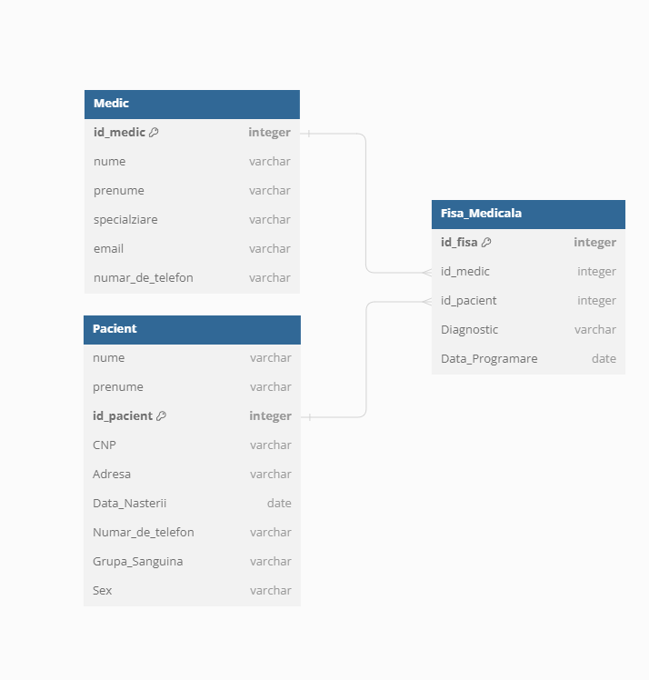
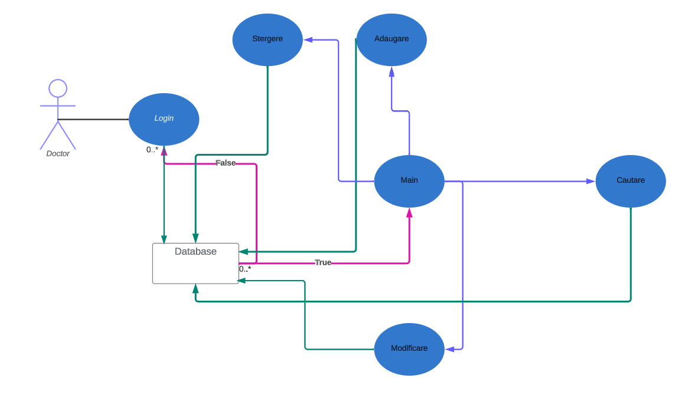

# Titlu project
### HealthTrack

## Descriere
HealthTrack este o aplicatie in Java care se ocupa cu gestionarea unui spital si care oferă funcționalități avansate pentru administrarea și monitorizarea activităților unui spital. Proiectul este conceput pentru a eficientiza procesele interne și pentru a asigura o îngrijire medicală de calitate pentru pacienți.
## Obiective
Proiectul are urmatoarele obiective:  
*Crearea unei interfete intuitive pentru a facilita gestiunarea rapida a datelor.  
*Implementarea metodelor de stergere, adauagre is modificare a pacientiilor si a fiselor medicale.  
*Stocarea si manipularea datelor intr-o baza de date.  
*Implemetarea unei metode de cautare pentru pacienti si fise medicale pentru a facilita eficienta doctoriilor.  

## Arhitectura.
Diagrama bazei de date:  

Diagrama UML:  

## Functionalitati/Exemple utilizare
Adaugarea, stergerea, modificarea datelor stocate in baza de date.  
Cautarea unui pacient sau a unei fise.  
Ecranele interfetei:  
    *pagina login  
    *pagina principala  
    *pagina vizualizare  
    *pagina de creare pacienti  
    *pagina de creare fisa medicala  
    *pagina de cautare  

### Resurse
Markdown Guide, [Online] Available: https://www.markdownguide.org/basic-syntax/ [accesed: Mar 14, 1706]
